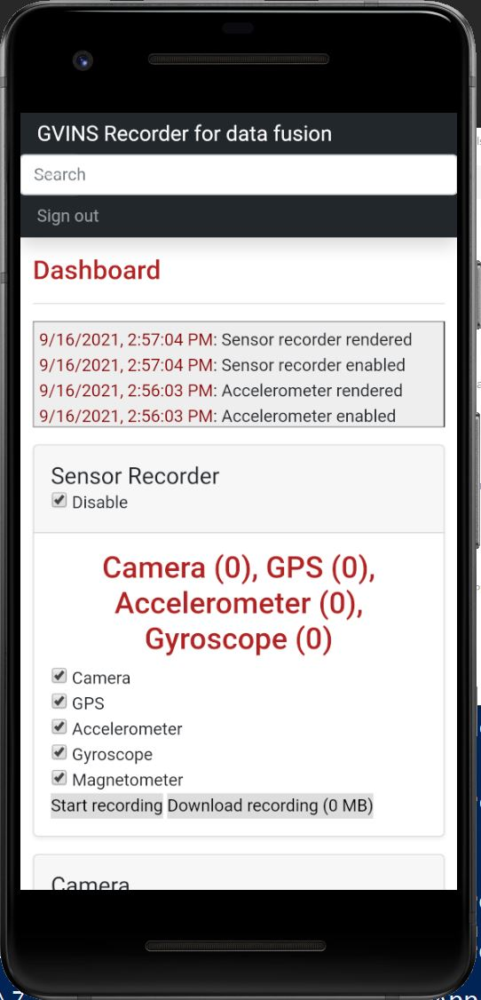
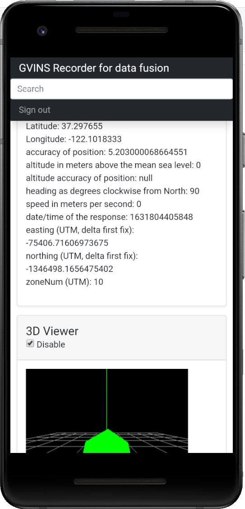
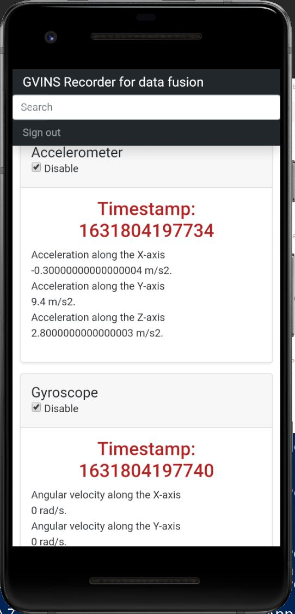
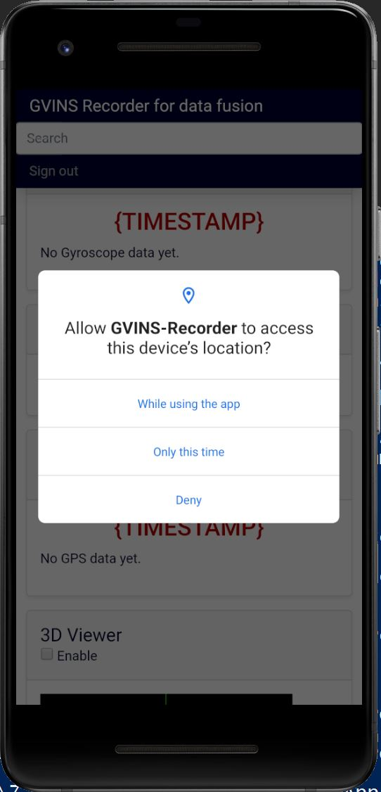

# GVINS_Recorder
This is a hybrid mobile app to record GPS, Visual and Inertial sensor data.

The app framework used here is Apache Cordova and the app itself is developed using web technologies (HTML5, CSS, JS). The aim is to provide a way to record sensor measurements for developing sensor fusion algorithms using a mobile phone with a common system clock (i.e. asynchronous sensor fusion).

This work was inspired by the GVINS-System from https://github.com/HKUST-Aerial-Robotics/GVINS. My goal is to test their fusion algorithm with my own dataset (and more importantly to ease the dataset creation process!).

## Screenshots

### How users can record sensor data:

### Example for Global Positioning System data:

### Example for Inertial (Accelerometer and Gyroscope) data:

### How users are asked for permission to use app features (like GPS in this case):

## Android version (Google Play Store)
https://play.google.com/store/apps/details?id=com.lwtv.gvins_recorder&gl=DE

