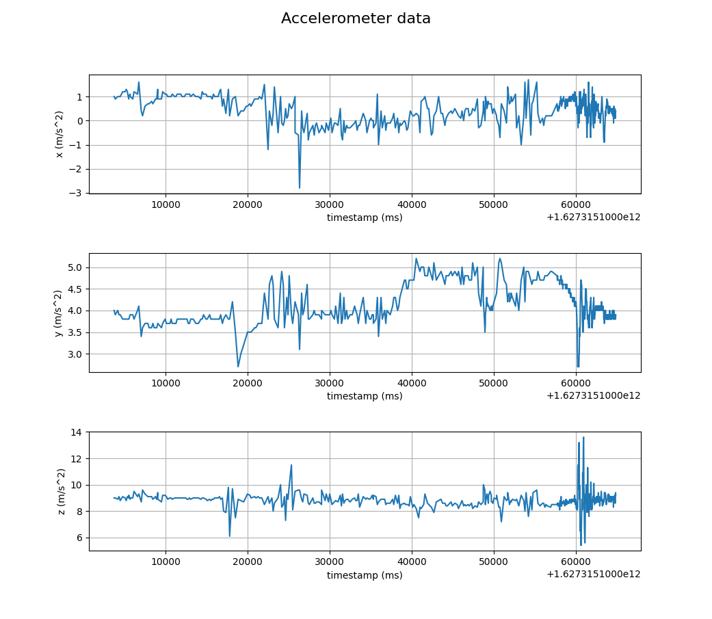
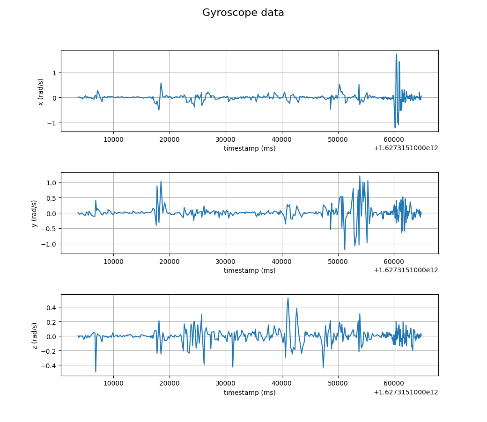
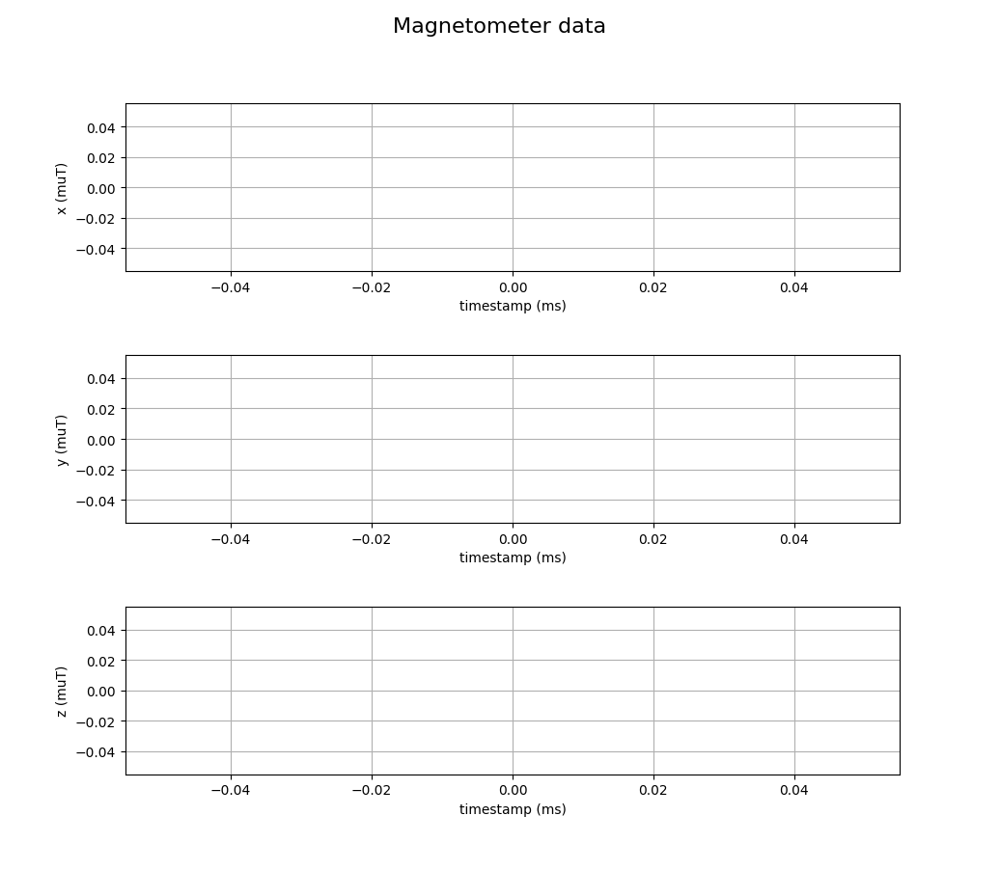
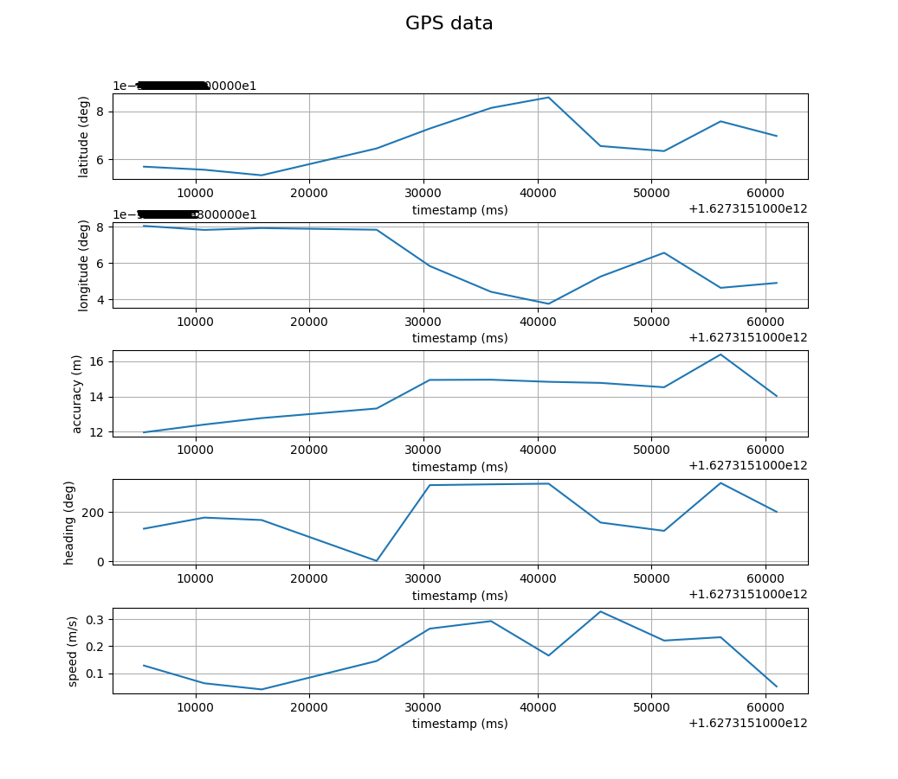

# GVINS_Recorder
This is a hybrid mobile app to record **G**NSS, **V**isual and **IN**ertial **S**ensor data.

The app framework used here is Apache Cordova and the app itself is developed using web technologies (HTML5, CSS, JS). The aim is to provide a way to record sensor measurements for developing sensor fusion algorithms using a mobile phone with a common system clock (i.e. asynchronous sensor fusion).

This work was inspired by the GVINS-System from https://github.com/HKUST-Aerial-Robotics/GVINS. My goal is to test their fusion algorithm with my own dataset (and more importantly to ease the dataset creation process!).

## Android version (Google Play Store)
https://play.google.com/store/apps/details?id=com.lwtv.gvins_recorder&gl=DE

## Screenshots

### How users can record sensor data:


### Example for Global Positioning System data:


### Example for Inertial (Accelerometer and Gyroscope) data:


### How users are asked for permission to use app features (like GPS in this case):


## Example of recorded sensor data

A user kindly asked about how the recorded sensor data can be used (Thanks to @belkahorry). It was quite embarrasing, that I did not include an example explaining this. Now you can find a plotting script written in Python in this repository (see in the folder "sample_data").

```console
foo@bar:~$ python .\parse-GVINS-Recorder-data.py 
{debug output - example for accelerometer}
{'time_ms': 1627315164706, 'x': 0.0017453292519943296, 'y': -0.07155849933176751, 'z': 0.0017453292519943296}
1627315164706.0 ms: 0.0017453292519943296 m/s^2 -0.07155849933176751 m/s^2 0.0017453292519943296 m/s^2
{...}
```

The script will write the camera images as .png files on the disk and generate the following plots:







(sorry, my phone does not include a magnetometer)




## Release Notes

### Version 1.0.1 (7 September 2021)
First sensor implementations: GPS, Accelerometer, Gyroscope and Magnetometer. No camera sensor yet.

### Version 1.0.2 (12 September 2021)
Added camera sensor implementation. Added error logging to User Interface.

### Version 1.0.3 (13 September 2021)
Fixed Camera capturing and added Sensor data export feature. Realized that a file management system with user feedback is needed in the future in order to make debugging easier.

### Next release (TODO):

- Storing recordings locally using IndexedDB (should work on browsers and mobile phones)
- Deletion of local recordings
- List recordings in User Interface

### After the next release (foreseeable future)

- Download recording from IndexedDB to local file system on the phone (does not work the same way on phones and browsers. Mobile is priority but harder to implement)
- Upload recording to my server (show modal dialog asking for permission to publish dataset using Creative-Commons-By-License)

### Future versions (low priority)

- Real-time visualization of GPS + IMU fused trajectory in 3D viewer
- Offline computation of 3D point clouds from camera images
